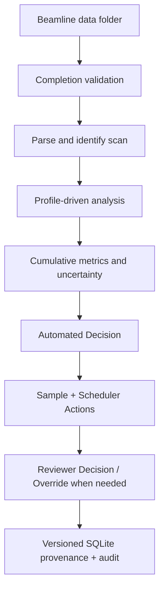

# Real-time XAS Beamtime Decision Framework

[](https://github.com/gchunhao/real-time-xas-beamtime-decision/releases)
[](https://www.python.org/)
[](LICENSE)
[](https://github.com/gchunhao/real-time-xas-beamtime-decision/actions/workflows/ci.yml)

A local, profile-driven decision-support application for X-ray absorption spectroscopy (XAS) beamtime. It watches a beamline data folder, validates and parses completed scans, updates cumulative quality estimates, and produces an automated scientific decision with supervisory Reviewer Decision/override in a live browser interface.

The project translates an experimental quality-control workflow into reproducible, versioned software while preserving explicit reviewer supervision and an auditable override path.

> **Safety boundary:** v0.2 has no physical acquisition/EPICS control. Automated decisions are **CONTINUE / STOP / REACQUIRE / REVIEW_REQUIRED**, but execution is simulated. Reviewer Decision is supervisory/override; REVIEW_REQUIRED holds the affected logical sample and allows the scheduler to advance.

## What it demonstrates

- Real-time scientific data ingestion with file-completion safeguards
- Profile-driven XANES quality metrics and transparent decision logic
- Human-in-the-loop review with reviewer identity and role provenance
- Reproducible algorithm/profile versioning in SQLite
- A Windows-friendly FastAPI and React/TypeScript application
- An extensible `(element, edge, scan type)` profile registry

## Workflow



## Project status

**v0.2.0 — research prototype.** The first implemented and frozen profile is `P_K_XANES_v1.2`. The application is suitable for demonstration, offline testing, and beamline-specific validation; it is not a validated instrument-control system.

> **v0.2 UI integration:** the React frontend now follows the frozen Athena-like
> mockup with Home, Live Workspace, Review Queue, Data Browser, Overlay Compare,
> Offline Analysis, Audit Logs, and Settings. `GET /api/workflow` is a read-only
> presentation projection; it does not alter QC or scientific decisions.

## Relevance to beamline science

This project is a working example of translating user-side XAS expertise into beamline software and data infrastructure. It is particularly relevant to tender-energy spectroscopy workflows such as P K-edge XANES:

- **Real-time XAS decision support:** converts incoming scans into continuously updated, explainable recommendations during limited beamtime.
- **P K-edge XANES domain model:** implements a frozen `P_K_XANES_v1.2` profile with explicit energy windows, robust residual metrics, anomaly guards, and quantitative/qualitative routes.
- **Reviewer supervision:** automated decisions are primary; reviewer records remain immutable, higher-level adjudication is supported, and explicit overrides are auditable.
- **Traceable algorithms:** links every recommendation to the contributing scans, cumulative average, metric values, profile snapshot, and algorithm version.
- **Beamline extensibility:** separates acquisition-folder monitoring, parsing, calibration, analysis profiles, decisions, and provenance so future beamline adapters can evolve independently.

The current release demonstrates software architecture and scientific workflow design. It does not claim operational deployment or beamline validation.

## First supported profile

`P_K_XANES_v1.2` is frozen as a standalone YAML profile. Its implemented rules are:

- Route A: `Q_HF <= 0.45%`
- Route B: `0.45% < Q_HF <= 0.70%`, `Q_pre <= 0.55%`, `Q_post <= 0.95%`, `A_spike <= 3.0`
- initial averaging exponent `alpha = 0.50`
- quantitative first, then qualitative fallback, then stop
- protected XANES anomalies are flagged and never automatically removed
- automatic masking is confined to configured safe pre/post-edge regions
- local normalization remains available when full pre/post coverage is poor but the protected feature region is usable
- `N_quant` is the fastest of Route A and Route B
- scan and time limits use the stricter constraint; time is recomputed from measured scan durations

ADP v1.0 remains shadow-calibrated and not production-promoted. Frozen v1.2 scientific thresholds are unchanged.

## Stack

- Python 3.10+
- FastAPI + Uvicorn
- SQLite
- NumPy + SciPy
- watchdog
- React + TypeScript + Vite

## Run on Windows

Install Python 3.10+ and Node.js 20+, then open PowerShell in this folder:

```powershell
py -m venv .venv
.\.venv\Scripts\Activate.ps1
python -m pip install -e .
cd frontend
npm install
npm run build
cd ..
xas-beamtime --config config\app.yaml
```

Open <http://127.0.0.1:8765>. For subsequent starts, `scripts\start_windows.ps1` performs the dependency/build check and starts the app.

## Windows desktop and operator workspace

Ordinary users install `XAS_Framework_v0.2_Setup.exe`, keep the default desktop
shortcut option selected, and launch **XAS Framework** from the desktop. No
Python or command prompt is required. Runtime data are stored under
`%LOCALAPPDATA%\XAS Framework`.

Developers can build the installer on Windows with Python 3.12, Node.js 22, and
Inno Setup 6:

```powershell
powershell -ExecutionPolicy Bypass -File packaging\windows\build_installer.ps1
```

The script tests both stacks, bundles the app, runs its safety smoke test, and
creates `build\installer\XAS_Framework_v0.2_Setup.exe`. The same build is
available through `.github/workflows/windows-installer.yml`.

- **Home** — session, decision, scheduler, and recent audit overview
- **Live Workspace** — Quality vs. Scan Number, cumulative-average spectrum, Automated Decision/marginal gain, and the Human Validation Panel
- **Review Queue** — pending/resolved/superseded cases with side-by-side Automated Decision and **Reviewer Decision**
- **Data Browser / Overlay Compare** — project/session/sample/scan resources, scan disposition, historical decisions, reviewer status, and audit history
- **Offline Analysis** — load existing complete spectra and keep monitoring the folder for new completed files

Reviewer Decision is not limited to beamline scientists. The saved reviewer roles are User, Beamline Scientist, PI, Postdoc, Student, Operator, and Other, with identity, authority level, review context, rating, override, notes, and processing choices retained for later calibration.

All scheduler text is deliberately explicit: **Beamline: Not Connected (v0.2)**, **AUTO (Simulation)**, and **Auto-execution: ELIGIBLE (Simulation)**. The software records the action that would occur but sends no acquisition-system command.

The included `config/app.yaml` watches `test_data/incoming`. Change the folder in the UI or configuration for the beamline computer. Use a UNC path or drive path on Windows as needed.

## Test-data hook

Create a fresh deterministic P K-edge sequence:

```powershell
python scripts\generate_test_data.py --output test_data\incoming --scans 6
```

Each file contains explicit element, edge, scan type, sample, scan number, duration, and beamline metadata. The parser also falls back to filename inference when fields are missing.

## Tests

```powershell
python -m unittest discover -s tests -v
```

Frontend production build and resource-contract tests:

```powershell
cd frontend
npm install
npm run build
npm test
```

The tests cover frozen thresholds, metadata parsing, core metrics, protected/safe anomaly behavior, resource constraints, scan disposition, review-queue behavior, reviewer adjudication, migrations, and v0.2 API contracts.

## Directory structure

```text
config/                         app and beamline calibration YAML
frontend/                       React/TypeScript working surface
reference_library/              external reference manifests/data
scripts/                        Windows launcher and data generator
test_data/incoming/             synthetic beamtime files
tests/                          backend unit/integration tests
xas_beamtime/
  analysis.py                   profile-driven metrics and averaging
  api.py                        FastAPI routes and static UI serving
  calibration.py                beamline-specific correction interface
  completion.py                 stable/readable/final-newline validation
  decision.py                   advisory state machine and N_quant
  parser.py                     universal text-table parser
  registry.py                   element/edge/scan-type profile registry
  service.py                    orchestration and in-memory live state
  storage.py                    SQLite provenance and human loop
  watcher.py                    watchdog folder events
  profiles/P_K_XANES/v1_2.yaml frozen profile
```

## Data and provenance

SQLite stores the requested first-version entities:

`project`, `session`, legacy `experiment`, `sample`, `scan`, `cumulative_average`, `metrics`, `decision`, `artifact_flag`, `human_review`, `review_queue`, `audit_event`, `profile_version`, and `algorithm_version`.

Every automatic decision points to a cumulative average, frozen profile snapshot, and algorithm version. Every human review points back to that decision. This supports direct later comparison of algorithm prediction against reviewer judgment, with reviewer role retained.

From two scans onward, the framework also records a deterministic scan-bootstrap 95% variability band for `Q_HF`. `N_quant` remains explicitly labeled as an unconfirmed power-law projection using the frozen initial `alpha=0.50` assumption.

Reviewer records include scan inclusion/exclusion, weighting mode, normalization anchors, glitch confirmations/rejections, Q-ready/QL-ready/Below-QL/QC-blocked rating, optional decision override, reviewer identity/role/level/context, and notes. Quality rating and decision override remain distinct.

## Add another profile

Add a versioned YAML file under `xas_beamtime/profiles/<ELEMENT>_<EDGE>_<TYPE>/`. The registry matches the parsed `(element, edge, scan_type)` identity. Framework modules and the database do not require edits for another declarative profile with the existing analysis contract. New metric families can be registered behind the same profile/engine boundary in a later release.

## External reference library

Reference spectra remain outside application code. Copy `reference_library/references.example.yaml` to `references.yaml`, add curated datasets under that directory, and record citations/provenance in the manifest. v0.1 exposes this interface but does not yet perform reference fitting.

## Known v0.2 boundaries

- Text/CSV-style XAS files are supported; HDF5/NeXus adapters are future parser plugins.
- No acquisition-system or EPICS commands are implemented.
- No `Quantitative confirmed` state is exposed.
- Qualitative guardrails are profile configuration subject to later blind validation; frozen Route A/B definitions are unchanged.
- Beamline calibration must be validated locally before scientific use.

## Roadmap

### v0.2 — validation and operator experience

- Add blinded back-testing utilities and structured comparison of algorithm recommendations against human reviews
- Add import/export of experiment summaries and audit-ready decision reports
- Improve the live dashboard with scan-level diagnostics and configurable operator views
- Expand automated tests for malformed, partial, duplicated, and out-of-order files

### v0.3 — beamline integration layer

- Add HDF5/NeXus parser adapters while retaining the universal text-table path
- Introduce read-only EPICS/acquisition metadata adapters; no automatic acquisition control
- Add beamline-specific calibration plugins and configuration validation
- Add signed-release publishing after institutional code-signing credentials are available

### v0.4 — additional spectroscopy profiles

- Validate the P K-edge profile against independent reference and beamtime datasets
- Register additional element/edge/scan-type profiles behind the same analysis contract
- Add curated reference-spectrum comparison with citation and provenance tracking
- Evaluate profile-specific uncertainty models after sufficient human-review data are collected

Any transition from advisory output to instrument control would require a separate safety review, explicit beamline authorization, and validation beyond this roadmap.
