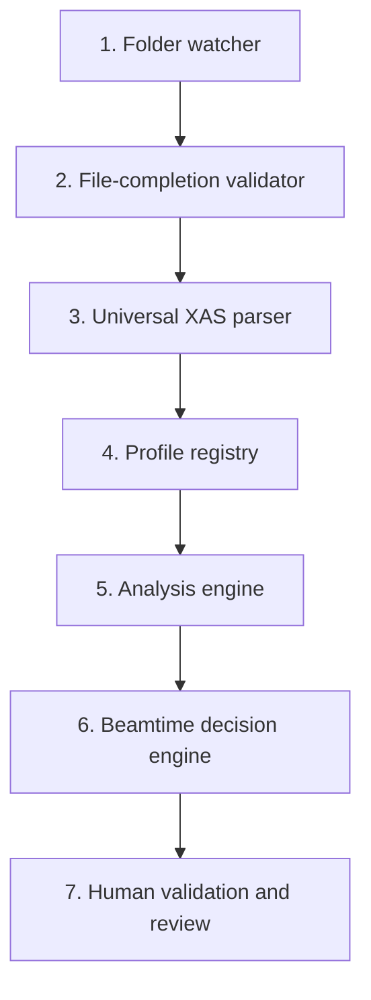

# Real-time XAS Beamtime Decision Framework

[](https://github.com/gchunhao/real-time-xas-beamtime-decision/releases)
[](https://www.python.org/)
[](LICENSE)
[](https://github.com/gchunhao/real-time-xas-beamtime-decision/actions/workflows/ci.yml)

A local-first, profile-driven application for **real-time and offline X-ray absorption spectroscopy (XAS) decision support**. It converts incoming scans into traceable quality evidence, resource-aware acquisition recommendations, and structured human review—without controlling the beamline.

The current release focuses on **P K-edge XANES** and is designed as a reusable framework for additional elements, edges, scan types, data formats, and beamline environments.

> **Safety boundary:** v0.2 has no physical acquisition or EPICS control. It records the action that would be taken, but sends no command to an instrument. Final authority remains with authorized beamtime personnel.

## The practical problem

Synchrotron beamtime is limited, while the value of another repeated scan is rarely obvious in real time. During an experiment, scientists must repeatedly decide:

- Is the newest file complete and scientifically usable?
- Has the cumulative spectrum reached quantitative or qualitative quality?
- Is an apparent feature real, noise, radiation damage, or an acquisition artifact?
- Would another scan materially improve the result?
- Should the current scan be excluded, reacquired, or escalated for review?
- Is the remaining scan or time budget better spent on this sample or the next one?

These decisions are often made under time pressure using plots, experience, and informal notes. The reasoning may be scientifically sound, but it is difficult to reproduce, audit, compare across reviewers, or reuse for future experiments.

This framework turns that informal decision process into an explicit software workflow. It continuously connects raw scans, cumulative averages, quality metrics, uncertainty, acquisition constraints, automated recommendations, reviewer judgments, and versioned provenance.

## What the software does

For live beamtime, the application watches a selected data folder and reacts only after a file passes completion checks. For offline work, the same pipeline can replay previously collected spectra. In either mode it:

1. validates and parses each completed scan;
2. identifies the appropriate profile from element, edge, and scan type;
3. evaluates scan-level and cumulative spectral quality;
4. estimates whether additional scans are likely to add useful information;
5. applies scan-count and time limits;
6. produces an explainable sample and scheduler action;
7. routes ambiguous or protected cases to structured human review; and
8. stores the complete decision chain in SQLite.

The result is not merely a spectrum viewer or a QC score. It is an **auditable beamtime decision layer** connecting scientific evidence to the next experimental action.

## Operator workspace

The v0.2 interface implements eight coordinated surfaces:

- **Home** — session status, current decision, simulated scheduler state, and recent audit activity
- **Live Workspace** — scan tree, cumulative spectrum, Quality vs. Scan Number, marginal-gain information, and Human Validation Panel
- **Review Queue** — pending, resolved, and superseded cases with automated and reviewer decisions shown side by side
- **Data Browser** — project, session, sample, scan, decision, disposition, and review resources
- **Overlay Compare** — raw or normalized scan comparison and cumulative-average inspection
- **Offline Analysis** — replay of existing spectra through the same traceable analysis pipeline
- **Audit Logs** — chronological provenance for scientific, review, and workflow events
- **Settings** — local session, profile, folder, and resource-limit configuration

Ordinary Windows users can install `XAS_Framework_v0.2_Setup.exe`, keep the default desktop shortcut, and launch **XAS Framework** without installing Python or using a command prompt.

## Scientific and decision architecture

A central design choice is to separate two questions that are often mixed together:

- **Is the spectrum scientifically adequate?**  
  Answered by the frozen scan-level quality profile, currently `P_K_XANES_v1.2`.

- **What should the experiment do next?**  
  Handled by a separately versioned Acquisition Decision Policy (ADP), resource constraints, workflow state, and human review.

This separation allows the acquisition policy to be calibrated or replaced without silently changing the scientific definition of spectral quality. In v0.2, ADP remains in **Shadow** evaluation rather than being promoted as an autonomous production policy.

### Seven-layer processing pipeline



Uncertainty, diagnostics, provenance, beamline calibration, and the human-learning loop cut across all seven layers.

### First frozen profile: P K-edge XANES

`P_K_XANES_v1.2` is stored as a standalone, versioned YAML profile. Among its implemented rules:

- `E0` is determined from the smoothed first-derivative maximum in the configured P K-edge window.
- Local pre-edge, white-line, protected feature, and post-edge regions are defined relative to `E0`.
- Robust metrics include `Q_HF`, `Q_pre`, `Q_post`, `A_spike`, inter-scan `E0` stability, signal-scale stability, and shape reproducibility.
- Route A uses `Q_HF <= 0.45%`.
- Route B uses `0.45% < Q_HF <= 0.70%`, `Q_pre <= 0.55%`, `Q_post <= 0.95%`, and `A_spike <= 3.0`.
- Protected XANES-region anomalies are flagged and never automatically removed.
- Automatic masking is confined to configured safe pre/post-edge regions.
- Local normalization remains available when full pre/post coverage is poor but the protected feature region remains usable.
- Scan and time limits are evaluated together, using the stricter constraint.

The initial averaging prediction uses the frozen `alpha = 0.50` assumption. Forecasts are explicitly presented as projections rather than confirmed quantitative results.

## Human-in-the-loop design

Automated output is primary evidence, not hidden authority. The review system records:

- reviewer identity, role, authority level, and review context;
- scan inclusion, exclusion, and weighting choices;
- normalization anchors and artifact judgments;
- quality rating separately from decision override;
- notes and the exact automated decision being reviewed; and
- all conflicting reviewer judgments.

When reviewer decisions conflict, the highest-level valid reviewer judgment becomes the adjudicated label, while every original decision remains preserved in the audit trail. These records are designed to support later blinded validation and policy calibration.

A `REVIEW_REQUIRED` result holds only the affected logical sample; the simulated scheduler can advance to other eligible work. This models a practical beamline workflow without automating physical acquisition.

## What is innovative here

The project explores a broader model for scientific beamline software:

- **Decision support rather than post-hoc plotting** — quality evidence is connected directly to the next experimental question.
- **Scientific model/policy separation** — frozen QC definitions remain stable while acquisition policies can be versioned and validated independently.
- **Provenance as a first-class output** — every recommendation is linked to its scans, cumulative average, metrics, profile snapshot, algorithm version, constraints, and reviews.
- **Protected-region-aware automation** — scientifically important features are escalated rather than silently removed as glitches.
- **Human judgments as calibration data** — structured reviewer decisions can improve later policies without erasing disagreement.
- **Local-first operation** — spectra and review history remain on the experiment computer unless the user explicitly exports them.
- **Safe integration path** — workflow projection and scheduler behavior can be evaluated in simulation before any future beamline connection is considered.

## Extensibility

The framework is designed so that new scientific and facility-specific capabilities can be added behind explicit interfaces.

| Extension point | Current implementation | Intended expansion |
|---|---|---|
| Profile registry | Versioned `(element, edge, scan_type)` matching | Additional element/edge profiles without changing orchestration or storage |
| Parser layer | Text/CSV-style XAS tables with metadata and filename fallback | HDF5, NeXus, and beamline-specific formats |
| Analysis engine | P K-edge XANES v1.2 metric contract | New metric families and profile-specific uncertainty models |
| Decision policy | Frozen rules plus ADP Shadow evaluation | Independently calibrated, versioned policies |
| Beamline calibration | Configuration interface and provenance hooks | Energy calibration and facility-specific corrections |
| Acquisition interface | Simulation and read-only workflow projection | Read-only EPICS/acquisition metadata adapters after validation |
| Reference library | External manifest with citation/provenance fields | Curated reference comparison and fitting modules |
| Resource API | Projects, sessions, samples, scans, decisions, reviews, and audit events | Reporting, export, and external visualization clients |

### Adding another spectroscopy profile

Add a versioned YAML file under:

```text
xas_beamtime/profiles/<ELEMENT>_<EDGE>_<SCAN_TYPE>/
```

The registry selects the profile using parsed `(element, edge, scan_type)` identity. A declarative profile that follows the existing analysis contract does not require changes to the watcher, completion validator, orchestration layer, API, or database.

Future profiles could cover other tender-, soft-, or hard-X-ray applications. Each profile should carry its own energy windows, metrics, thresholds, uncertainty assumptions, calibration evidence, test data, and version history rather than inheriting P K-edge rules by analogy.

## Implementation

### Core stack

- Python 3.10+
- FastAPI + Uvicorn
- SQLite
- NumPy + SciPy
- watchdog
- React + TypeScript + Vite
- PyInstaller + Inno Setup for Windows packaging

### Repository structure

```text
config/                         application and calibration YAML
frontend/                       React/TypeScript operator workspace
packaging/windows/              PyInstaller and Inno Setup build files
reference_library/              external reference manifests and data
scripts/                        test-data and developer utilities
test_data/incoming/             synthetic beamtime sequence
tests/                          backend unit and integration tests
xas_beamtime/
  analysis.py                   profile-driven metrics and averaging
  api.py                        FastAPI and presentation/resource APIs
  calibration.py                beamline-calibration interface
  completion.py                 file-completion safeguards
  decision.py                   advisory decision logic
  disposition.py                scan disposition
  parser.py                     universal text-table parser
  registry.py                   element/edge/scan-type profile registry
  scheduler.py                  simulated scheduler actions
  service.py                    orchestration and workflow projection
  storage.py                    SQLite provenance and review loop
  profiles/P_K_XANES/v1_2.yaml frozen first profile
```

### Data and provenance

SQLite stores projects, sessions, experiments, samples, scans, cumulative averages, metrics, decisions, artifact flags, scan dispositions, human reviews, review queues, audit events, profile versions, and algorithm versions.

Every automatic decision points to the cumulative average, frozen profile snapshot, and algorithm version that produced it. Every review points back to the decision it evaluated.

## Verification status

The v0.2 source and Windows packaging path have been exercised through local and GitHub-hosted tests:

| Check | Result |
|---|---:|
| Backend unit/integration tests | 17 passed |
| Frontend tests | 5 passed |
| Frontend production build | Passed |
| Source-mode launcher smoke test | Passed |
| Windows packaged smoke test | Passed |
| Windows installer artifact creation | Passed |
| Acquisition control enabled | No |

The Windows workflow builds the application with PyInstaller, creates `XAS_Framework_v0.2_Setup.exe` with Inno Setup, starts the packaged application in smoke-test mode, verifies its API and safety state, and uploads the installer as a GitHub Actions artifact.

## Install and run

### Windows installer

Download the `XAS_Framework_v0.2_Setup` artifact from the **Windows installer** GitHub Actions workflow. Run `XAS_Framework_v0.2_Setup.exe`, keep **Create a desktop shortcut** selected, and launch **XAS Framework**.

Runtime configuration, incoming data, reference files, and SQLite history are stored under:

```text
%LOCALAPPDATA%\XAS Framework
```

The current installer is not commercially code-signed, so Windows may display an unknown-publisher or SmartScreen warning.

### Run from source

Install Python 3.10+ and Node.js 20+, then:

```powershell
py -m venv .venv
.\.venv\Scripts\Activate.ps1
python -m pip install -e .
cd frontend
npm install
npm run build
cd ..
xas-beamtime --config config\app.yaml
```

Open <http://127.0.0.1:8765>.

Generate a deterministic synthetic P K-edge sequence with:

```powershell
python scripts\generate_test_data.py --output test_data\incoming --scans 6
```

## Current limitations

v0.2 is a **research prototype**, not a validated instrument-control system.

- Scientific thresholds have not yet completed independent, blinded, multi-beamline validation.
- ADP v1.0 remains in Shadow calibration and is not promoted as a production acquisition policy.
- Text/CSV-style input is supported; HDF5 and NeXus adapters are not yet implemented.
- Beamline-specific energy calibration must be validated locally before scientific use.
- Reference-spectrum fitting is not yet implemented.
- The framework does not expose a “Quantitative confirmed” state.
- No EPICS or acquisition-system command is sent.
- The Windows installer is not code-signed.
- Operational deployment, cybersecurity review, and representative beamline-workstation testing remain future work.

## Roadmap

### v0.3 — scientific validation and reporting

- blinded replay against independent beamtime and reference datasets;
- structured comparison between recommendations and adjudicated reviewer labels;
- experiment-summary and audit-ready report export;
- stress testing for malformed, partial, duplicated, delayed, and out-of-order files; and
- improved uncertainty calibration and forecast diagnostics.

### v0.4 — interoperability and additional profiles

- HDF5 and NeXus parser adapters;
- read-only EPICS and acquisition-metadata adapters;
- facility-specific calibration plugins and configuration validation;
- additional `(element, edge, scan_type)` profiles with independent validation packages; and
- curated reference-spectrum comparison with citation and provenance tracking.

### Toward a validated advisory release

A future validated release would require documented performance criteria, representative beamline testing, controlled profile promotion, signed distribution, operational and cybersecurity review, and explicit facility approval. Any transition from advisory output to instrument control would be a separate project with its own safety case.

## License and citation

Released under the [MIT License](LICENSE). Citation metadata are provided in [CITATION.cff](CITATION.cff).
