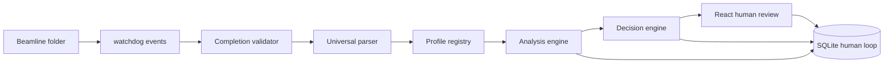
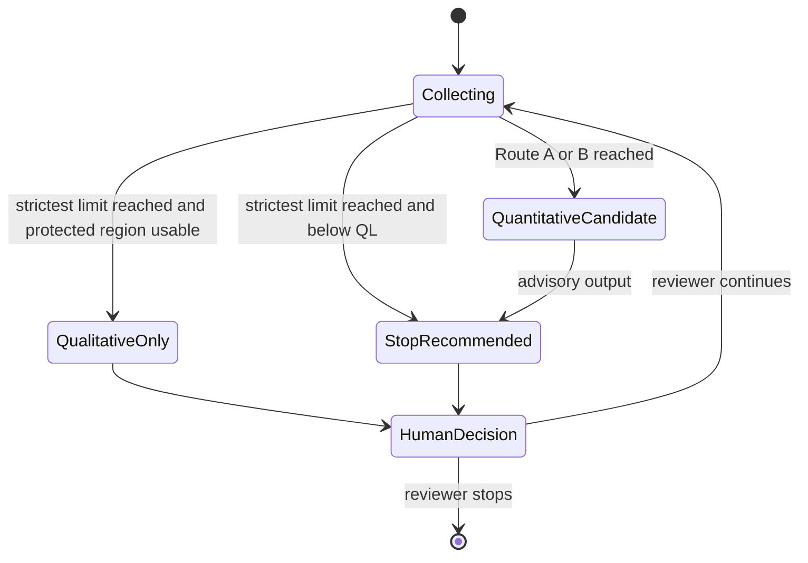
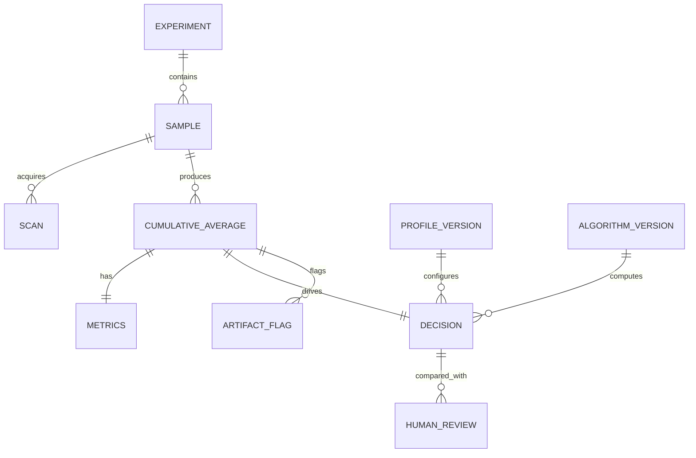

# Core architecture (v0.1, unchanged by the v0.2 UI release)

## Real-time flow

The path ends in advice, not acquisition control. `DecisionEngine` returns one of `CONTINUE`, `QL ONLY`, or `STOP RECOMMENDED`. A beamline user, beamline scientist, PI/experiment lead, or another authorized reviewer may validate it. No driver, EPICS write, stop command, or acquisition callback exists in v0.1.

## Component boundaries

| Component | Responsibility | Extension boundary |
| --- | --- | --- |
| Folder watcher | Detect created, moved, or completed modifications | watchdog observer adapter |
| Completion validator | Stable size, readable handle, minimum size, final newline | Alternate validators for HDF5/NeXus |
| Universal parser | Numeric table plus metadata aliases and filename fallback | Format-specific parser adapters |
| Profile registry | Match element, edge, and scan type | Versioned YAML profiles |
| Analysis engine | Alignment, safe masking, averaging, metrics, uncertainty | Metric-family engine registry |
| Decision engine | Route, limits, marginal gain, advisory state | Profile policy without acquisition actions |
| Human validation | Review spectra, artifacts, inclusion, anchors, rating, override | Stored calibration observations |

## State machine

`Quantitative confirmed` is not a v0.1 state. State values are stored as text and decision/review records are append-only, so a future confirmation state will not require changing foreign keys or replacing a database enum.

## Provenance and feedback relation

The scientific learning query is therefore direct: automatic recommendation and metrics join to human rating/override through `decision_id`, with reviewer role plus exact profile and algorithm snapshots retained.
