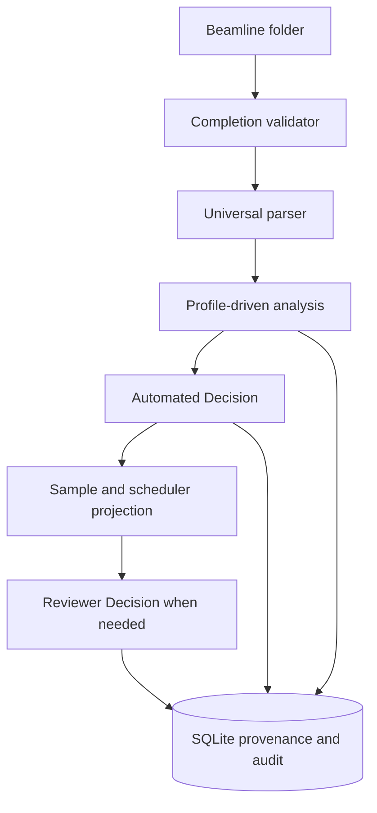
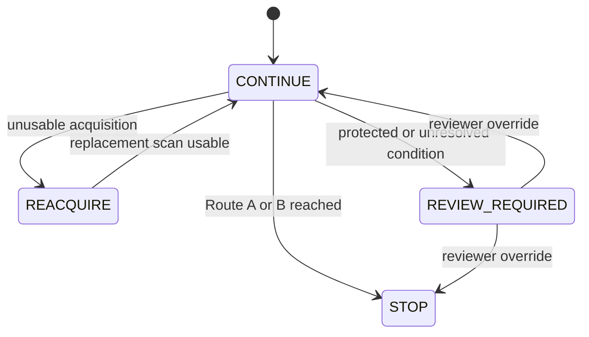
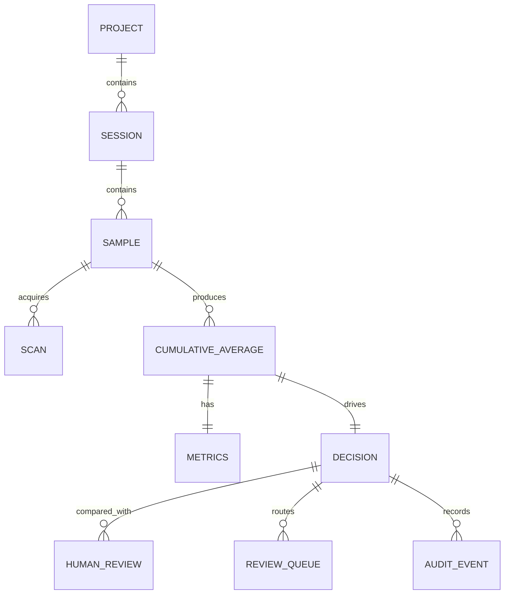

# v0.2 architecture

## Real-time flow

The frozen `P_K_XANES_v1.2` profile owns scan-level QC and target attainment. `ADP_v1.0-shadow` owns scan-count forecasting and converts the scientific result into explicit sample and scheduler actions. Every usable new scan invalidates the prior forecast and triggers full reevaluation. No EPICS or acquisition command is implemented; scheduler execution is simulation-only.

## Component boundaries

| Component | Responsibility | Extension boundary |
| --- | --- | --- |
| Folder watcher | Detect created, moved, or completed files | watchdog observer adapter |
| Completion validator | Stable size, readable handle, minimum size, final newline | HDF5/NeXus validators |
| Universal parser | Numeric table, metadata aliases, filename fallback | Format-specific adapters |
| Profile registry | Match element, edge, and scan type | Versioned YAML profiles |
| Analysis engine | Alignment, safe masking, averaging, metrics, uncertainty | Metric-family registry |
| Decision engine | Frozen target check plus ADP Shadow prediction | Separately versioned policy |
| Disposition service | Separate physical and usable scan counts | Beamline-specific disposition rules |
| Scheduler adapter | Project sample/scheduler actions | Simulation in v0.2; no instrument driver |
| Reviewer workflow | Rating, notes, processing choices, optional override | Immutable calibration observations |
| Resource API | Project/session/sample/scan/decision/review/audit projections | Additional read models |

## Decision and review behavior

Automated Decision is primary. Reviewer Decision is supervisory: no reviewer record means no override, not approval. A quality rating alone does not resolve a `REVIEW_REQUIRED` item. Conflicting reviewer decisions are retained; the highest-level valid reviewer judgment becomes the adjudicated label, while same-level conflicts remain explicit.

## Provenance and feedback relation

Automatic results, reviewer records, scan disposition, profile snapshots, algorithm versions, and scheduler projections remain independently auditable.
